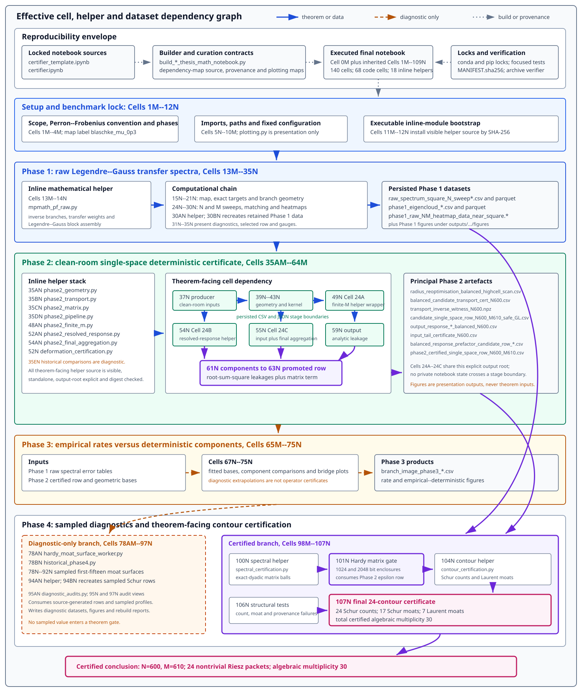

# Certified Blaschke transfer-operator spectra

This repository is the public numerical companion to the thesis and the
reproducibility release for the symmetric degree-two Blaschke deformation
benchmark `blaschke_mu_0p3`. It connects the thesis's analytic approximation
theory to a computer-assisted spectral certificate for the associated compact
Perron--Frobenius transfer operator. The deployed configuration is
`N=600`, `M=610`, `rho=2.725`, and
`r=2.473669807791324109321273260`.

Reproduction is judged by the mathematical certificate, not by byte-for-byte
equality of paths, archives, plots, compression containers, timings, or
toolchain-sensitive witness arrays.

## Thesis abstract

This thesis develops a certified approximation framework for the spectra of
compact Perron--Frobenius transfer operators associated with analytic
full-branch expanding interval maps. The aim is not only to compute
resonances, but to place the computation on a single Hardy space over a
Bernstein ellipse, so that the resulting finite matrices are immediately
suitable for spectral perturbation and subsequent certification.

The construction begins with a Legendre--Hardy toolkit on Bernstein ellipses.
Joukowski geometry is used to relate ellipse traces to Fourier--Laurent data,
allowing Legendre growth, coefficient decay, projection tails, and
Gauss--Legendre quadrature errors to be estimated in one analytic language.
These estimates feed into a transfer-aware Legendre--Gauss assembly built from
inverse branches and Perron--Frobenius weights. The finite blocks are therefore
transfer approximations, not Koopman discretisations.

The main contribution is the Chebyshev-packet Hardy gauge. Legendre
polynomials are natural for real-line quadrature, but they do not measure the
Hardy norm intrinsically. The thesis introduces an explicit transport from
Legendre coordinates, through scaled Legendre coordinates, into an
orthonormal Chebyshev-packet gauge. This converts real-line transfer blocks
into operator estimates on one fixed Hardy space. A uniform Riesz analysis of
the scaled Legendre family then stabilises this transport and yields an
explicit deterministic single-space perturbation bound with an exponential
convergence rate.

The theory identifies two analytic sources of this rate: output escape across
nested ellipses and input contraction through branch images. Numerically, the
framework is implemented for the symmetric `mu=0.3` degree-two Blaschke
interval benchmark with `N=600` and `M=610`. Complete-boundary validated
arithmetic gives a certified single-space perturbation radius, and
complete-contour resolvent enclosures transfer the finite Riesz ranks enclosed
by twenty-four nontrivial certified contours, with total algebraic
multiplicity 30, to the exact operator.

The exact eigenvalue `1` is treated separately, while `0` remains the
non-isolated compact-spectrum accumulation point. Together with the exact
Blaschke spectral formula, the computer-assisted local rank certificates yield
a hybrid complete exterior spectral description. In this computation the
collocation contribution is negligible compared with the analytic
single-space tail. The thesis therefore supplies a fixed-space bridge from
Legendre--Gauss transfer approximation to computer-assisted spectral
certification of Ruelle--Pollicott resonances.

## From Bandtlow-related theory to the certificate

1. **Analytic Legendre foundations.** Bandtlow-related analytic approximation
   results, combined with Joukowski geometry, express traces on Bernstein
   ellipses as symmetric Fourier--Laurent data. This gives explicit Legendre
   growth, coefficient-decay, and quadrature estimates.

2. **Compact embeddings and projection tails.** The restriction maps
   `H^2(E_R) -> H^infinity(E_r)` and
   `H^infinity(E_R) -> H^2(E_r)` convert analytic decay into finite-rank
   projection tails with geometric factor `(r/R)^N`.

3. **Perron--Frobenius transfer assembly.** Gauss--Legendre quadrature builds
   the finite transfer block from inverse branches and Perron--Frobenius
   weights. The matrix approximates the transfer operator, not the forward
   Koopman operator.

4. **One fixed Hardy space.** The exact operator and its finite-rank lift are
   both placed on `X=H^2(E_r)`, under the nested-ellipse condition
   `1 < r_tau(rho) < r < rho`.

5. **Chebyshev-packet coordinate transport.** Legendre coefficients are first
   scaled and then transported to an `X`-orthonormal packet gauge,
   `c -> D_(r,N)c -> T_N(r)y`. Uniform Riesz bounds prevent the coordinate
   change from deteriorating with dimension.

6. **Deterministic single-space envelope.** Resolved-output leakage,
   branch-image unresolved-input leakage, and the transported finite-`M`
   collocation defect are combined into a rigorous `X -> X` perturbation
   radius. Its natural geometric rate is governed by
   `max{r/rho, r_tau(rho)/r}`.

7. **Complete-contour certification.** An authoritative 2048-bit Hardy
   enclosure, exact-dyadic Schur data, and seven Laurent approximate-inverse
   witnesses establish complete-circle resolvent moats. A small-gain test then
   transfers each finite Riesz rank to the exact compact operator.

8. **Blaschke spectral conclusion.** The 24 nontrivial contours contain
   18 simple `alpha^j` packets and six multiplicity-two `mu^j` packets, for
   total algebraic multiplicity 30. The exact eigenvalue `1` is handled
   separately. Exterior completeness is hybrid: it combines the local
   computer-assisted rank certificates with the external exact Blaschke
   spectral formula.

The exact thesis-to-notebook labels, chapter titles, source paths, and mapped
source hashes are recorded in
[`Numerics/numerical_certification_transfer_markdown.toml`](Numerics/numerical_certification_transfer_markdown.toml).
The central manuscript anchors are Chapter 4, Section 4.3
(`legEDMD:single-space-bridge`), and Chapter 5
(`chap:numerical-certification-transfer`), especially its numerical
methodology and contour-validation sections.

## What the code does

| Stage | Main source | Role |
| --- | --- | --- |
| Public entry point | [`reproduce-certificate.sh`](reproduce-certificate.sh) | Authenticates the release identity and selects full replay, stored-artifact inspection, or no-compute preflight. |
| Safe staging and orchestration | [`Numerics/run_blaschke_certificate_reproduction.py`](Numerics/run_blaschke_certificate_reproduction.py), [`Numerics/run_blaschke_clean_room_replay.py`](Numerics/run_blaschke_clean_room_replay.py) | Creates a fresh source-only scratch tree and regenerates the fixed theorem closure without altering the checkout. |
| Branch geometry and Phase 2 transfer bound | [`Numerics/blaschke_deformation_phase2_geometry.py`](Numerics/blaschke_deformation_phase2_geometry.py), [`Numerics/blaschke_deformation_phase2_transport.py`](Numerics/blaschke_deformation_phase2_transport.py), [`Numerics/blaschke_deformation_phase2_matrix.py`](Numerics/blaschke_deformation_phase2_matrix.py), [`Numerics/blaschke_deformation_phase2_final_aggregation.py`](Numerics/blaschke_deformation_phase2_final_aggregation.py) | Certifies the common Hardy radius, branch contraction, finite-`M` transport, matrix contribution, input tail, response prefactor, and final single-space perturbation radius. |
| Hardy and spectral reference | [`Numerics/blaschke_deformation_spectral_certification.py`](Numerics/blaschke_deformation_spectral_certification.py) | Builds the authoritative 2048-bit interval Hardy reference and the exact-dyadic finite matrix data used by the spectral stage. |
| Contour/Riesz certification | [`Numerics/blaschke_deformation_contour_certification.py`](Numerics/blaschke_deformation_contour_certification.py) | Recomputes finite counts, Schur and Laurent complete-circle moats, small-gain inequalities, and the final 24-target rank certificate. |
| Independent semantic verification | [`Numerics/verify_blaschke_certificate_equivalence.py`](Numerics/verify_blaschke_certificate_equivalence.py) | Re-derives the theorem inequalities and discrete structure from primitive stored or freshly generated fields rather than trusting summary booleans. |
| Thesis notebook and presentation | [`Numerics/build_blaschke_deformation_thesis_math_notebook.py`](Numerics/build_blaschke_deformation_thesis_math_notebook.py), [`Numerics/blaschke_deformation_certifier_thesis_math.ipynb`](Numerics/blaschke_deformation_certifier_thesis_math.ipynb) | Keeps the cell/helper layout aligned with the thesis and presents the calculations, diagnostics, and plots in reading order. |

The principal theorem-facing outputs are under
[`Numerics/outputs/blaschke_deformation_certifier`](Numerics/outputs/blaschke_deformation_certifier/):

- the final Phase 2 response-prefactor row;
- the authoritative balanced Hardy matrix gate;
- the 24-target spectral-certificate CSV and matching JSON report;
- the validated Schur enclosure and attempt report;
- the Laurent mode-bound and exact-dyadic reconstruction tables.

Full-resolution plots live in
[`Numerics/outputs/blaschke_deformation_certifier/figures`](Numerics/outputs/blaschke_deformation_certifier/figures/).

## What the computation shows

The currently committed theorem artifacts report:

| Quantity | Certified or stored result |
| --- | --- |
| Approximation size | `N=600`, `M=610` |
| Common Hardy geometry | `rho=2.725`, `r=2.473669807791324109321273260`, derived `r_tau/r <= 0.927` |
| Single-space perturbation upper bound | `epsilon <= 3.3264433839016544e-20` |
| Nontrivial certified contours | `24` |
| Algebraic multiplicity | `30 = 18 x 1 + 6 x 2` |
| Count and moat routes | all 24 counts from Schur data; 17 Schur moats and 7 Laurent moats |
| Smallest lifted moat among the 24 rows | `1.6293968031243122e-13` |
| Largest rederived small-gain product among the 24 rows | `2.0415182953122976e-7 < 1` |
| Final row gates | all 24 finite-count, complete-circle, zero-exclusion, small-gain, and finite-to-exact rank-transfer gates pass |

These are spectral-packet statements about the associated transfer operator.
They are not claims that a plot, a sampled singular value, or a digest alone is
a proof. Phase 1 sweeps, historical Phase 4 surfaces, sampled Schur tables, and
plotting products remain useful diagnostics but do not enter the theorem gate.

## Thesis notebook and helper dependency map

- [Executed thesis-mathematics notebook with plot previews](Numerics/blaschke_deformation_certifier_thesis_math.ipynb)
- [Readable notebook dependency map](Numerics/blaschke_deformation_notebook_dependency_map.md)
- [Standalone dependency-map SVG](Numerics/blaschke_deformation_notebook_dependency_map.svg)
- [Machine-readable thesis mapping contract](Numerics/numerical_certification_transfer_markdown.toml)



The committed notebook preserves the thesis-result layout: 141 ordered cells,
68 code cells, 18 digest-checked inline helpers, stable display labels, and the
terminal auditor Cell `110M`. Its GitHub display copy retains all 34 plot
positions across 20 visual cells. For practical GitHub rendering, those
embedded previews are compact JPEGs, while all tables, text, streams, and
other non-image outputs remain in their original cells and order; only
machine-local scratch paths are replaced by portable display markers;
cell IDs, order, sources, helper positions, execution counts, and plot
positions remain aligned with the executed thesis-result notebook. The
full-resolution figures remain beside it. The source-only replay does not
trust notebook outputs: it rebuilds the locked output-free source notebook in
a fresh scratch tree before regenerating theorem evidence.

### Reader's guide to cells, helpers, and thesis roles

| Stable notebook cells | What the reader sees | Principal helper modules | Thesis/evidence role |
| --- | --- | --- | --- |
| `0M` | Dependency map and reading boundary | [`numerical_certification_transfer_markdown.toml`](Numerics/numerical_certification_transfer_markdown.toml) | Maps all 52 Markdown owners and 68 code cells to Chapter 5 and their direct Chapter 4 prerequisites. |
| `1M`--`12N` | Map constants, `N`, `M`, `rho`, `r`, precision, paths, and inline-module bootstrap | notebook bootstrap | Reproducible execution infrastructure and Chapter 5 provenance; no numerical theorem gate. |
| `13M`--`21N` | Raw high-precision Perron--Frobenius block, target names, and inverse-branch geometry | [`mpmath_pf_raw.py`](Numerics/mpmath_pf_raw.py), [`transfer_spectrum_certification.py`](Numerics/transfer_spectrum_certification.py) | Implements the Legendre--Gauss transfer block and geometry inputs; raw comparison is not yet the single-space certificate. |
| `22M`--`31N` | Raw spectra, cluster matching, finite-`M` sweeps, and Phase 1 figures | [`blaschke_deformation_phase1_diagnostics.py`](Numerics/blaschke_deformation_phase1_diagnostics.py) at `30AM`/helper and producer `30BN` | Chapter 5 Phase 1 empirical diagnostics and plots only. |
| `32M`--`35N` | Ordinary Legendre, pure-`r`, and Hardy coordinate gauges | notebook calculations | Explains the coordinate chain used by the Chapter 4 Chebyshev-packet bridge; finite floating-point diagnostics only. |
| `35AM`--`37N` | Complete-boundary geometry, transport witness, matrix term, and clean-room Phase 2 assembly | [`blaschke_deformation_phase2_geometry.py`](Numerics/blaschke_deformation_phase2_geometry.py), [`blaschke_deformation_phase2_transport.py`](Numerics/blaschke_deformation_phase2_transport.py), [`blaschke_deformation_phase2_matrix.py`](Numerics/blaschke_deformation_phase2_matrix.py), [`blaschke_deformation_phase2_pipeline.py`](Numerics/blaschke_deformation_phase2_pipeline.py), [`blaschke_deformation_historical_comparisons.py`](Numerics/blaschke_deformation_historical_comparisons.py) | The first four helpers produce certified Phase 2 inputs; the historical comparison is diagnostic. |
| `38M`--`47N` | Branch-image profiles, unresolved-tail profiles, and component visualisations | [`plotting.py`](Numerics/plotting.py) | Presents the pointwise unresolved-tail kernel and geometry; plots are diagnostic. |
| `48M`--`49N` | Safe Gauss--Legendre remainder and finite-`M` rescaling | [`blaschke_deformation_phase2_finite_m.py`](Numerics/blaschke_deformation_phase2_finite_m.py) | Theorem-facing certified finite-`M` component of the single-space envelope. |
| `50M`--`54N` | Complete-boundary input tail and resolved response | [`blaschke_deformation_certification.py`](Numerics/blaschke_deformation_certification.py), [`blaschke_deformation_phase2_resolved_response.py`](Numerics/blaschke_deformation_phase2_resolved_response.py) | Theorem-facing unresolved-input and resolved-output components. |
| `54AM`--`64M` | Orthogonal RSS aggregation, promoted Phase 2 radius, audit tables, and component plots | [`blaschke_deformation_phase2_final_aggregation.py`](Numerics/blaschke_deformation_phase2_final_aggregation.py) | Produces and checks the final theorem-facing `X -> X` perturbation radius. |
| `65M`--`75N` | Fitted rates compared with the deterministic bound | [`plotting.py`](Numerics/plotting.py) | Chapter 5 Phase 3 rate diagnostics and plots only. |
| `76M`--`92N` | Historical Phase 4 singular-value profiles, surfaces, and dashboards | [`hardy_moat_surface_worker.py`](Numerics/hardy_moat_surface_worker.py), [`blaschke_deformation_historical_phase4.py`](Numerics/blaschke_deformation_historical_phase4.py) | Retained sampled diagnostics; explicitly non-authoritative and skipped by theorem-only replay. |
| `93M`--`97N` | Sampled Schur ladder, status audits, and candidate-contour displays | [`blaschke_deformation_sampled_schur_diagnostics.py`](Numerics/blaschke_deformation_sampled_schur_diagnostics.py), [`blaschke_deformation_diagnostic_audits.py`](Numerics/blaschke_deformation_diagnostic_audits.py) | Diagnostic validation and presentation; sampled values do not certify complete contours. |
| `98M`--`101N` | Authoritative 2048-bit Hardy interval matrix, exact-dyadic midpoint, and `eta_A` gate | [`blaschke_deformation_spectral_certification.py`](Numerics/blaschke_deformation_spectral_certification.py), producer `101N` | Theorem-facing certified finite matrix; the 1024-bit starting row is optional diagnostic evidence. |
| `102M`--`107N` | Exact-dyadic Schur counts, 17 Schur moats, seven Laurent moats, adversarial checks, and final producer | [`blaschke_deformation_contour_certification.py`](Numerics/blaschke_deformation_contour_certification.py), producer `107N` | Produces the final 24-target finite-to-exact Riesz-rank certificate. |
| `108N`--`110M` | Certificate interpretation and terminal auditor boundary | none | Adds no new numerical evidence; explains the certified and diagnostic boundaries. |

These are stable display labels, not a lexicographic sort key: inserted helper
labels such as `35AM`, `52AM`, and `78AM` occur at their fixed physical
positions in the notebook. In particular, `101N` and `107N` are the
theorem-producing cells; the immediately preceding helper cells expose the
source used by those producers.

The longer [dependency-map explanation](Numerics/blaschke_deformation_notebook_dependency_map.md)
records individual producer boundaries, persisted paths, arrow semantics, and
the exact relation between the generated notebook and the research thesis.

## Evidence status and certificate-equivalent scope

Acceptance remains strict for source authentication, environment identity,
the common canonical radius and `q`-gap, exact Phase 2 inequalities, ordered
targets and multiplicities, routes and counts, complete-circle constructions,
perturbation subtractions, zero exclusion, positive lifted moats, and every
theorem gate.

The comparison deliberately ignores only absolute or temporary paths,
wall-clock timings, widget/runtime metadata, plotting encodings, cache
placement, archive/container formatting, and explicitly diagnostic-only
sampled tables or provenance digests. Numerically harmless last-digit changes
are acceptable only when the new one-sided enclosures still satisfy the same
primitive inequalities and theorem gates.

## Mathematical provenance

The analytic route uses the thesis's Bandtlow-related Legendre--EDMD toolkit,
the Joukowski/Bernstein-ellipse Hardy analysis, the scaled-Legendre uniform
Riesz result, and the single-space Chebyshev-packet bridge. The exact symmetric
interval target families are benchmark data from
Slipantschuk--Bandtlow--Just (2013, equation 21), also recorded for this map in
Akindji--Slipantschuk--Bandtlow--Just (2026, Section 3.2). Those references
identify the target windows. This release recomputes the finite counts,
complete-circle moats, perturbation transports, and small-gain gates from the
authenticated sources independently of checked-in generated evidence.

## Auditor replay operations

The authoritative command requires a release identity obtained independently
from the mutable checkout. For a GitHub tag or Release, use the commit ID
published by GitHub:

```bash
EXPECTED_RELEASE_COMMIT='<40-hex commit from the GitHub tag or Release>'
./reproduce-certificate.sh full --expected-git-commit "$EXPECTED_RELEASE_COMMIT"
```

For an extracted source archive without `.git`, use the inventory SHA-256
published alongside the Release with
`--expected-release-inventory-sha256`. Never derive either expected value from
the checkout being authenticated.

Full mode creates or checks the locked environment, authenticates the finite
Git-tree inventory, stages a fresh source-only scratch copy, regenerates the
fixed 27-file theorem closure, and runs the semantic verifier. Its success
status is exactly:

```text
CERTIFICATION_CONFIRMED
```

Only full mode is a source-level recomputation of the theorem certificate,
independent of retained generated artifacts. It is not a new human derivation
or an alternate mathematical proof. It does not run the retired raw-byte
comparator, notebook normaliser, archive comparator, or publication-provenance
refresh.

See [`release/REPLAY.md`](release/REPLAY.md) for the detailed auditor sequence,
receipt fields, and failure interpretation.

### Full source replay

```bash
EXPECTED_RELEASE_COMMIT='<40-hex commit from the GitHub tag or Release>'
./reproduce-certificate.sh full --expected-git-commit "$EXPECTED_RELEASE_COMMIT"
```

The wrapper creates `.certificate-replay-env/` from
[`conda-explicit-lock.txt`](conda-explicit-lock.txt), installs the seven exact
hash-locked pip overrides, and binds a local Jupyter kernel to that interpreter.
It deliberately skips historical Phase 4 and the non-authoritative 1024-bit
Hardy starting audit; the authoritative 2048-bit Hardy interval and all seven
Laurent witness families are regenerated. Large transient coefficient tensors
are verified in memory and discarded rather than committed. The receipt must
record `tracked_source_bytes_mutated=false`.

An already authenticated pinned runtime can be reused:

```bash
EXPECTED_RELEASE_COMMIT='<40-hex commit from the GitHub tag or Release>'
./reproduce-certificate.sh full \
  --expected-git-commit "$EXPECTED_RELEASE_COMMIT" \
  --existing-python /absolute/path/to/bin/python
```

The runtime shortcut remains fail-closed: Python, theorem-critical packages,
`pip check`, single-thread OpenBLAS identity and location, and the ephemeral
kernel specification are checked again.

### Stored-artifact check

```bash
EXPECTED_RELEASE_COMMIT='<40-hex commit from the GitHub tag or Release>'
./reproduce-certificate.sh quick --expected-git-commit "$EXPECTED_RELEASE_COMMIT"
```

This checks source and artifact hashes, schemas, exact discrete structure,
primitive inequalities, theorem gates, and internal bindings in the artifacts
already present. Its success status is:

```text
ARTIFACT_SEMANTICS_CONFIRMED_NON_INDEPENDENT
```

This mode is useful for inspection, but it is not an independent theorem
recomputation because it does not regenerate the Hardy intervals or Laurent
witnesses.

### No-compute preflight

```bash
EXPECTED_RELEASE_COMMIT='<40-hex commit from the GitHub tag or Release>'
./reproduce-certificate.sh dry-run --expected-git-commit "$EXPECTED_RELEASE_COMMIT"
```

This validates the finite source inventory, locks, interpreter, `pip check`,
BLAS identity, kernel binding, safe staging, and replay/verifier interfaces. It
starts no numerical producer and reports:

```text
DRY_RUN_READY_NO_CERTIFICATION
```

### What the semantic verifier re-derives

The verifier does not trust stored summary booleans in place of primitive
one-sided data. Among its integrity and schema checks, it requires:

- one exact Decimal Hardy radius across selected geometry, Phase 2,
  authoritative 2048-bit Hardy, Schur, and contour artifacts;
- the exact rational gate `r_tau_upper / r <= 0.927`;
- exact rational Phase 2 RSS-square, triangle, and epsilon inequalities;
- the ordered 24 target families, multiplicity total 30, and theorem routes
  `17` Schur-moat plus `7` Laurent-moat;
- all theorem gates, finite-count transports, zero exclusion, and complete
  circle coverage;
- all 24 Schur diagonal counts recomputed from decoded binary64 `T` and exact
  rational circle centres and radii, with an exactly zero lower triangle;
- Schur lower bounds rederived as
  `1 / (inverse_upper * Q_condition_upper)`;
- Laurent lower bounds rederived as
  `(1 - residual_upper) / (coefficient_upper * Q_condition_upper)` from the
  exact-dyadic witness summaries;
- the `eta_schur` and `eta_A` subtractions, a positive lifted moat, and the
  rederived small-gain ratio `epsilon / lifted_moat < 1`.

The stored aggregate small-gain display is diagnostic because independently
outward-rounded component displays need not reaggregate to the same final ULP.
The theorem decision is made from primitive one-sided fields with exact
rational arithmetic.

## System requirements

- Linux x86_64;
- Bash and Git;
- Conda or Micromamba for first-time creation of the exact environment;
- at least 8 GiB RAM and 8 GiB free scratch disk;
- approximately 3.1 GB for the locked environment.

The full route recreates large interval matrices and seven Laurent witness
families in memory. Runtime and peak memory depend on the machine and are
recorded in the replay receipt; wall-clock equality is not an acceptance gate.

## Environment and package inventory

Human-readable principal package list for the certified runtime:

| Purpose | Packages |
| --- | --- |
| Interpreter and dense numerics | Python `3.13.2`; NumPy `2.3.2`; SciPy `1.16.0`; OpenBLAS `0.3.30` pthreads, checked single-threaded |
| Validated and high-precision arithmetic | python-flint `0.8.0`; mpmath `1.3.0` |
| Tables and persisted data | pandas `2.3.3`; PyArrow `24.0.0` |
| Runtime control | threadpoolctl `3.6.0`; pip `26.1.2` |
| Notebook execution | ipykernel `6.30.1`; jupyter-client `8.6.3`; jupyter-server `2.20.0`; nbformat `5.10.4`; nbclient `0.10.2` |
| Plots and notebook presentation | Matplotlib `3.10.5`; Pillow `11.3.0`; ipywidgets `8.1.7`; tqdm `4.67.3` |

The authoritative environment closure is not this summary table:

- [`conda-explicit-lock.txt`](conda-explicit-lock.txt) pins all 455 Conda
  artifacts for Linux x86_64;
- [`pip-requirements-lock.txt`](pip-requirements-lock.txt) supplies seven exact
  hash-locked overrides;
- [`requirements.txt`](requirements.txt) lists the 13 direct compatibility
  requirements for development and inspection.

## Release integrity and CI

[`release/source-only-replay-inventory.json`](release/source-only-replay-inventory.json)
lists the complete finite Git-tree release and binds every member by SHA-256.
The stager validates it before copying regular files into a fresh narrow
scratch root; symlinks, traversal, missing files, extra files, and hash drift
fail closed. The original checkout is preserved.

Pull-request CI performs source compilation, lock and inventory checks, and
focused semantic negative tests. GitHub's event-provided `github.sha` acts as
the external identity for the checked-out CI tree. Full replay is intentionally
a manual job on a Linux x86_64 self-hosted runner.
